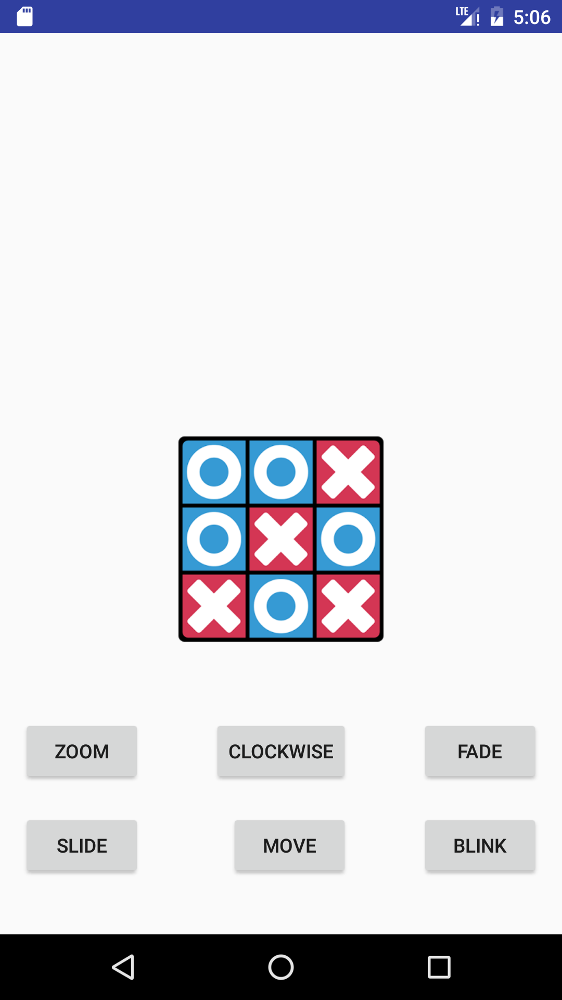

# Animations
## Types of animations in Android
#### In Android you can animate things in two ways :
1. Using **java**
2. Using **XML**

## Animations in this project
#### This project contains some basic animations in Android using XML code.
Types of animations in this project :
* **Blink Effect**
* **Clockwise Rotation**
* **Fade Effect**
* **Straight Movement**
* **Zoom Effect**
* **Slide Effect**

## Screenshots

## How to launch the project
1. Download **Android Studio** from the Google Developers site, using the link : "https://developer.android.com/studio/index.html" .
2. Install the file to your pc.
3. Download the required **SDK(Standard Development Kit) Tools** .
4. **Clone the repository** from : "https://github.com/DipanshKhandelwal/Animations.git" .
5. Open the project in Android Studio.
6. For launching the project you can either :
	1. **Install emulator**
		* For this you must have **HAMX (Hardware Accelerated Execution Manager)** installed in Android Studio IDE.
		* You can download it at the time of installation of the Android Studio or install it afterwards in the **SDK manager**.
		* Use your **AVD manager** for launching the app.
	2. **Use your Android Phone**
		* For using your phone, firstly connect your Android Phone with the pc using a data cable.
		* Go to the Settings > Developers Setting.
		* **Allow USB debugging**.
		* **Run** the project from the Android Studio IDE.